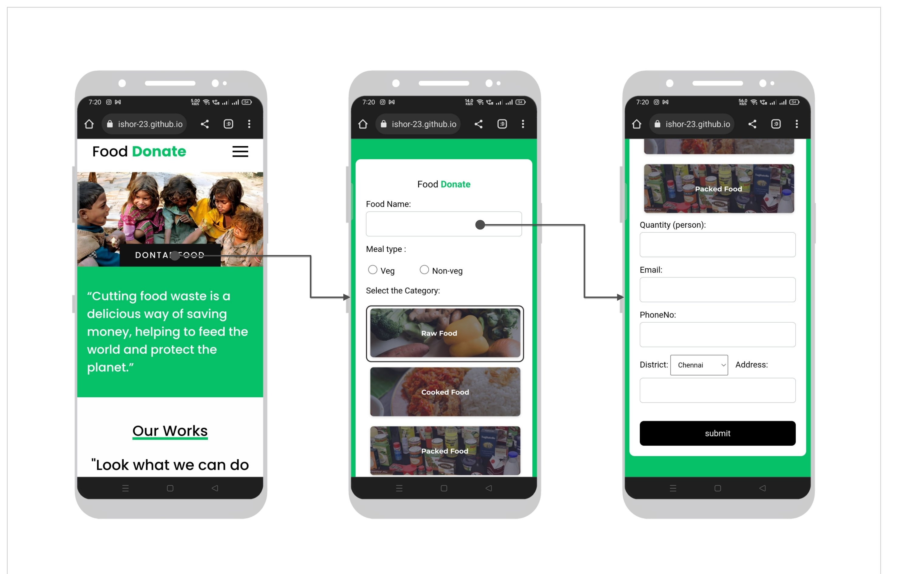
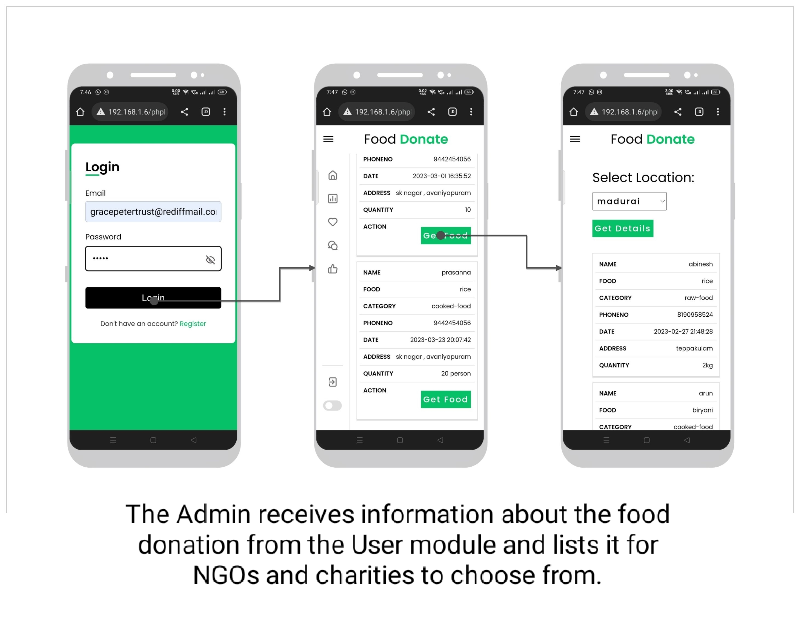
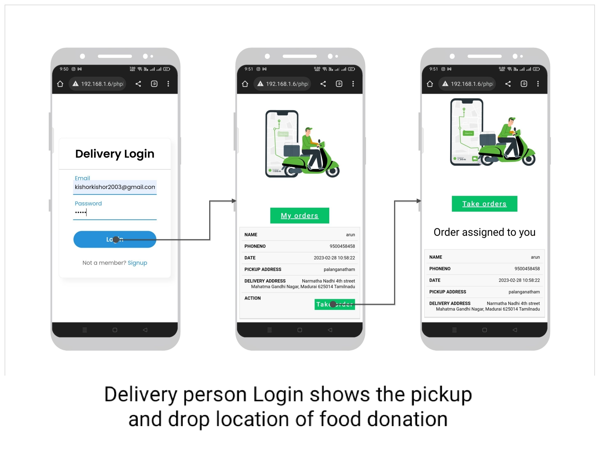

<h1>Food Waste Management System</h1>

<!-- Removed incorrect image comment -->

The basic concept of this project is to collect excess/leftover food from donors such as hotels, restaurants, marriage halls, etc., and distribute it to needy people.

<h2>Tools and Technologies</h2>
<ul>
    <li><strong>Frontend:</strong> HTML, CSS, JavaScript</li>
    <li><strong>Backend:</strong> PHP</li>
    <li><strong>Web Server:</strong> XAMPP</li>
    <li><strong>Database:</strong> MySQL</li>
</ul>

<h2>The system has three modules:</h2>
<ul>
    <li><strong>User</strong></li>
    <li><strong>Admin</strong></li>
    <li><strong>Delivery</strong></li>
</ul>

<h3>User Module</h3>

The User module allows individuals, restaurants, and event halls to donate excess food. Users can register, log in, and list food donations, specifying the type and quantity. The system matches their donation with nearby needy individuals or organizations.

<h3>Admin Module</h3>

The Admin module is managed by NGOs, charities, and trusts. Admins review donated food details, list them for organizations, and track food requests and pickups.

<h3>Delivery Module</h3>

Registered delivery personnel provide pickup and drop-off services for NGOs and charities. The module displays the pickup and drop locations of food donations.

<h2>How to Run the Project</h2>
<ol>
    <li>Download the project ZIP file.</li>
    <li>Extract the file and copy the folder.</li>
    <li>Paste inside the root directory:
        <ul>
            <li><strong>XAMPP:</strong> `xampp/htdocs`</li>
            <li><strong>WAMP:</strong> `wamp/www`</li>
            <li><strong>LAMP:</strong> `var/www/html`</li>
        </ul>
    </li>
    <li>Open PHPMyAdmin (`http://localhost/phpmyadmin`).</li>
    <li>Create a new database.</li>
    <li>Import `demo.sql` file (found inside the database folder).</li>
    <li>Run the script in your browser: `http://localhost/folderName`</li>
</ol>

<!-- Images with proper references -->
<h3>User Module</h3>

<h3>Admin Module</h3>

<h3>Delivery Module</h3>

